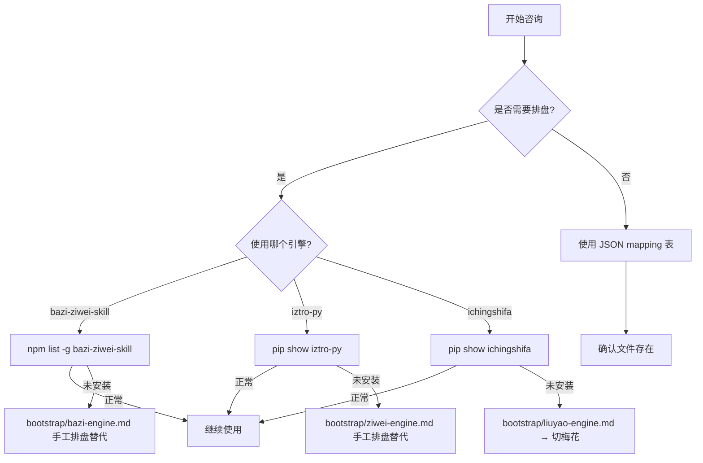

# tool-index.md — 工具索引

> 本文件记录 chinese-traditional-wisdom-skill 依赖的所有外部工具和键值映射表的状态。
> 用于诊断工具可用性、快速定位备用方案、识别缺失依赖。

---

## 外部引擎（排盘/推算/占卜）

| 工具 | 类型 | 安装路径 / 检查方式 | 输入 | 输出 | 备用方案 | 依赖 |
|------|------|---------------------|------|------|---------|------|
| bazi-ziwei-skill (npm) | 八字排盘 | `npm list -g bazi-ziwei-skill` | 四柱字符串 | 天干地支+十神+大运+神煞 | 手工排盘表 | Node.js 18+ |
| iztro-py (pip) | 紫微斗数排盘 | `pip show iztro-py` | 生辰+性别 | 12宫+14主星+四化+格局 | 手工排盘 | Python 3.9+ |
| ichingshifa (pip) | 六爻起卦 | `pip show ichingshifa` | 起卦方式参数 | 卦象+纳甲+六亲+世应 | 梅花易数 | Python 3.8+ |
| meihua-yishu (pip) | 梅花易数起卦 | `pip show meihua-yishu` | 数字/时间/物象 | 卦象+体用生克 | 六爻 | Python 3.8+ |
| yunqi-api | 五运六气推算 | API端点可达性 | 年份 | 岁运+司天在泉+六气 | 手工推算表 | 网络 |
| constitution-questionnaire | 体质辨识问卷 | `pip show constitution-questionnaire` (?) | 60+题回答 | 九种体质评分 | 手工辨析 | Python 3.8+ |

**bootstrap 指南位置**（每个引擎有对应指南，包含用法示例、输入输出格式、可视化数据格式）：`bootstrap/`

| 引擎 | 指南文件 |
|------|---------|
| 八字排盘 | bootstrap/bazi-engine.md |
| 紫微斗数 | bootstrap/ziwei-engine.md |
| 六爻卜卦 | bootstrap/liuyao-engine.md |
| 梅花易数 | bootstrap/meihua-yishu-engine.md |
| 五运六气 | bootstrap/yunqi-integration.md |
| 体质辨识 | bootstrap/constitution-questionnaire.md |
| 风水堪舆 | bootstrap/fengshui-guide.md |

---

## Dashboard 能力边界

| 模块 | Dashboard 状态 | 说明 |
|------|----------------|------|
| 八字 | 本地精确计算 / 本地近似计算 fallback | 默认加载 `visual/vendor/lunar-javascript-1.7.7.js` 读取精确节气干支；关闭精确历法或加载失败时回退 `visual/js/engines/bazi-engine.js`。 |
| 五运六气 | 本地精确边界 / 本地近似计算 fallback | 默认加载 `visual/vendor/lunar-javascript-1.7.7.js` 按大寒边界修正运气年份；关闭精确历法或加载失败时回退公历年近似。 |
| 紫微斗数 | 演示数据 / 需外部引擎 | 真实排盘需 `iztro-py` 或等价引擎。 |
| 六爻 | 演示数据 / 需外部引擎 | 真实起卦需 `ichingshifa` 或人工纳甲规则。 |
| 梅花易数 | 本地规则计算 | 内置时间起卦 Adapter，按年月日时生成上下卦、动爻、互卦、变卦和体用生克；不同流派可能存在口径差异。 |
| 风水罗盘 / 飞星 / 八宅 | 本地规则计算 | 基于 Canvas 和 JSON 映射表离线运行。 |

能力状态统一由 `visual/js/capabilities.js` 管理，Dashboard 通过 `FORTUNE.getCapabilities()` 暴露只读查询。
---

## 键值映射表（JSON）

用于确定性命理/风水查表，替代 embedding / 向量检索。**无外部依赖，文件存在即可用。**

| 映射表 | 文件 | 用途 | 条目数 |
|--------|------|------|--------|
| 命卦（东四/西四命） | knowledge-base/fengshui/mappings/life-trigram.json | 宅主命卦查询 → 八宅匹配 | ~64 |
| 八宅大游年 | knowledge-base/fengshui/mappings/eight-mansions.json | 八宅吉凶方位 + 四颗吉星/四颗凶星 | ~8 |
| 二十四山 | knowledge-base/fengshui/mappings/twenty-four-mountains.json | 24山方位+五行+吉凶属性 | 24 |
| 流年飞星 | knowledge-base/fengshui/mappings/yearly-flying-stars.json | 紫白九星逐年飞布+吉凶色+化解 | ~180 |
| 阳宅三要 | knowledge-base/fengshui/mappings/three-essentials.json | 门主灶三要+六事吉凶 | ~24 |
| 形煞分类与化解 | knowledge-base/fengshui/mappings/form-sha-cures.json | 19 种形煞的识别+影响+化解方法 | 19 |

---

## 可视化前端

| 工具 | 类型 | 入口 | 注意事项 |
|------|------|------|---------|
| Canvas 2D API | 浏览器原生 | visual/index.html | 无需依赖 |
| Mermaid.js v10.9.1 | 可选 CDN | visual/index.html (script src) | 网络失败时显示离线降级提示，不阻塞 Canvas 模块 |
| Chart.js | CDN | visual/index.html (script src) | 雷达图 + 扇形图 |
| lunar-javascript 1.7.7 | 浏览器内置 vendor | `visual/vendor/lunar-javascript-1.7.7.js` | MIT；提供 `Solar` / `Lunar` / `EightChar`，用于八字节气干支和五运六气大寒边界 |
| ToolManifest 工具目录 | 浏览器原生 | `visual/js/tool-manifest.js` | 统一首页卡片、工具分类、入口标签、能力键、隐私等级和报告区块元数据 |
| 引擎 Adapter 注册表 | 浏览器原生 | `visual/js/engine-adapters.js` | 统一八字、五运六气、紫微、六爻、梅花的 `calculate()` / `toRenderData()` 契约 |
| 文档契约检查 | Node.js | `node visual/js/tests/check-doc-contracts.mjs` | 校验 README/SKILL/tool-index/ROADMAP 与入口文件、报告字段、隐私约束一致 |
| 全局同步回归 | 浏览器 | `visual/test-runner.html` | 校验 FORTUNE 全局更新后各标签页控件与画布同步 |

---

## 安装检查流程

执行咨询前，按以下顺序检查工具可用性：

---

## 故障处理

| 症状 | 可能原因 | 处理 |
|------|---------|------|
| 排盘结果全空 | 引擎未安装或版本不兼容 | 切手工排盘（参考 bootstrap 指南） |
| 六爻起卦返回错误 | API 参数格式不对 | 检查 `ichingshifa` 输入格式，或用梅花替代 |
| JSON mapping 文件读不到 | 路径不对或文件缺失 | 检查 knowledge-base/fengshui/mappings/ 下文件，并运行 `node visual/js/tests/check-mapping-schema.mjs` |
| Mermaid 图不显示 | CDN 加载失败 / display:none 渲染 | 查看离线提示；Canvas 核心模块可继续使用 |
| 可视化页面打不开 | 未双击 index.html | 直接在浏览器打开 visual/index.html |
