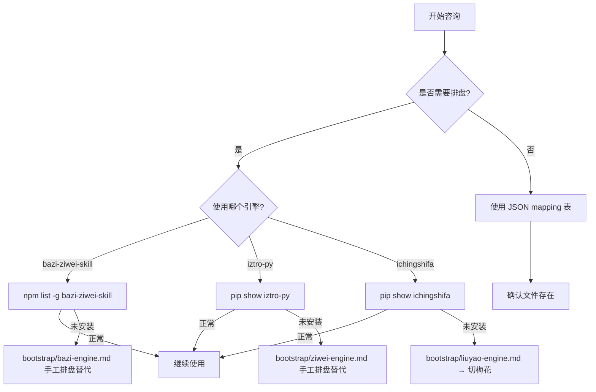

# tool-index.md — 工具索引

> 本文件记录 chinese-traditional-wisdom-ai-agent-workflow 依赖的所有外部工具和键值映射表的状态。
> 用于诊断工具可用性、快速定位备用方案、识别缺失依赖。

---

## 外部引擎（排盘/推算/占卜）

| 工具 | 类型 | 安装路径 / 检查方式 | 输入 | 输出 | 备用方案 | 依赖 |
|------|------|---------------------|------|------|---------|------|
| bazi-ziwei-skill (npm) | 八字排盘 | `npm list -g bazi-ziwei-skill` | 四柱字符串 | 天干地支+十神+大运+神煞 | 手工排盘表 | Node.js 18+ |
| iztro-py (pip) | 紫微斗数排盘 | `pip show iztro-py` | 生辰+性别 | 12宫+14主星+四化+格局 | 手工排盘 | Python 3.9+ |
| ichingshifa (pip) | 六爻起卦（可选 oracle） | `pip show ichingshifa` | 起卦方式参数 | 卦象+纳甲+六亲+世应 | 本地纳甲引擎 / 梅花易数 | Python 3.8+ |
| meihua-yishu (pip) | 梅花易数起卦 | `pip show meihua-yishu` | 数字/时间/物象 | 卦象+体用生克 | 六爻 | Python 3.8+ |
| yunqi-api | 五运六气推算 | API端点可达性 | 年份 | 岁运+司天在泉+六气 | 手工推算表 | 网络 |
| constitution-questionnaire | 体质辨识问卷 | `pip show constitution-questionnaire` (?) | 60+题回答 | 九种体质评分 | 手工辨析 | Python 3.8+ |

**bootstrap 指南位置**（每个引擎有对应指南，包含用法示例、输入输出格式、可视化数据格式）：`bootstrap/`

| 引擎 | 指南文件 |
|------|---------|
| 八字排盘 | bootstrap/bazi-engine.md |
| 紫微斗数 | bootstrap/ziwei-engine.md |
| 六爻卜卦 | bootstrap/liuyao-engine.md |
| 梅花易数 | bootstrap/meihua-yishu-engine.md |
| 五运六气 | bootstrap/yunqi-integration.md |
| 体质辨识 | bootstrap/constitution-questionnaire.md |
| 风水堪舆 | bootstrap/fengshui-guide.md |

---

## 纯 TS 引擎 + ToolEnvelope（2026-07-10 架构重构后推荐路径）

> 架构层重构后，6 个旧 JS Adapter + 若干 A 类引擎已全部迁移成**纯 TS、零 DOM 依赖**，统一返回 `ToolEnvelope` 结构。MCP server 与 React Dashboard 共享同一份引擎。旧 JS 保留作 fallback。

**统一信封结构**（`apps/visual/src/legacy/baseTypes.ts`）：
```ts
ToolEnvelope<TData> = { ok, tool, version, input_normalized, data: TData & { export_snapshot }, summary?, warnings?, error? }
```
`data.export_snapshot` = `{ summary, tags, sections, sourceNotes }` 稳定段表，供 LLM/报告渲染消费。

| 引擎 | 文件 | envelope 函数 | 接入方式 |
|------|------|--------------|---------|
| 周公解梦 | `legacy/envelopeSample.ts` | `searchDreamEnveloped` | 纯查表 |
| 喜用神 | `legacy/envelopeAdapters.ts` | `calcXiYongEnveloped` | 纯查表 |
| 姓名五维评分 | `legacy/envelopeAdapters.ts` | `calcNameRatingEnveloped` | 纯查表 |
| 体质倾向 | `legacy/envelopeAdapters.ts` | `getConstitutionTendencyEnveloped` | 纯查表 |
| 梅花易数 | `legacy/meihuaEngine.ts` | `calcMeihuaEnveloped` | Solar 参数化 |
| 五运六气 | `legacy/yunqiEngine.ts` | `calcYunqiEnveloped` | Solar 参数化(大寒定年) |
| 六爻纳甲 | `legacy/liuyaoEngine.ts` | `calcLiuyaoEnveloped` | Solar 参数化(日干支/空亡) |
| 八字排盘 | `legacy/baziEngine.ts` | `calcBaziEnveloped` | Solar 参数化(节气干支) |
| 紫微斗数 | `legacy/ziweiEngine.ts` | `calcZiweiEnveloped` | ESM `import { astro } from 'iztro'` |
| 奇门遁甲 | `legacy/qimenEngine.ts` | `calcQimenEnveloped` | ESM `import { QimenChart } from '3meta'` |
| 大六壬 | `legacy/daliurenEngine.ts` | `calcDaliurenEnveloped` | Solar 参数化(天地盘/四课/三传) |
| 二十八星宿 | `legacy/xingxiuEngine.ts` | `calcXingXiuEnveloped` | Solar 参数化(值宿推算) |
| 太乙神数 | `legacy/taiyiEngine.ts` | `calcTaiyiEnveloped` | Solar 参数化(积年/局数/落宫) |
| 联合分析 | `legacy/comboEngine.ts` | `calcAnnualFortuneCombo` / `calcDecisionCombo` / `calcSpaceTimeCombo` / `calcSanshiCombo` / `calcSanshiClassicCombo` | 聚合各引擎 |
| 太岁流年神煞 | `legacy/taisuiEngine.ts` | `calcTaisui` | 纯查表(年支) |
| 门主灶三要 | `legacy/menZhuZaoEngine.ts` | `calcMenZhuZao` | 纯查表(五行生克) |
| 64 卦古典文本 | `legacy/ichingTexts.ts` + `ichingTexts.json` | `getHexagramText` | 纯查表(卦辞/爻辞/彖传) |
| 24 节气养生 | `legacy/jieqiWellness.ts` | `queryJieqiWellness` | 纯查表(节气×体质) |
| 子午流注经络 | `legacy/meridianClock.ts` | `getMeridianByHour` | 纯查表(12时辰×12经络) |

**Solar 参数化模式**：lunar-javascript 的 Solar 入口作为可选入参，传入走精确（local-exact），未传走本地近似（local-approx）。MCP 端 `import { Solar } from 'lunar-javascript'` 传入；Dashboard 端用 `window.Solar`（vendor）传入。

---

## MCP Server（三层架构 Layer 2）

> `apps/mcp-server/`：薄壳包装上述 enveloped 引擎为 MCP 工具，供 Claude Code/Desktop/Cursor/Cline 调用。无计算逻辑，import 纯 TS 引擎。

**24 个 MCP 工具**（22 计算 + 2 元工具）：
- 排盘计算（14）：`bazi_calculate` / `ziwei_chart` / `cast_liuyao` / `arrange_qimen` / `liuren_calculate` / `xingxiu_daily` / `taiyi_calculate` / `huangji_calculate` / `cast_meihua` / `calc_yunqi` / `analyze_name` / `calc_xiyong` / `get_constitution_tendency` / `dream_interpret`
- 跨系统联合分析（8）：`combo_annual_fortune` / `combo_monthly_fortune` / `combo_decision` / `combo_space_time` / `combo_sanshi` / `combo_sanshi_classic` / `combo_daily_wellness` / `combo_zeri`
- 元工具（2）：`agent_guidance`（参数引导防瞎猜）+ `wisdom_dispatch`（自然语言意图路由）

**一键自动配置**（无需手动编辑 JSON）：
```bash
node scripts/setup-mcp.mjs            # 自动检测并配置所有已装客户端
node scripts/setup-mcp.mjs --check    # 仅检查
```

详见 `apps/mcp-server/README.md` 与 `examples/`。SKILL.md「MCP 自动激活」节引导 AI 在用户说"启用 MCP"时自主跑此脚本。

---

## Dashboard 能力边界

| 模块 | Dashboard 状态 | 说明 |
|------|----------------|------|
| 八字 | 本地精确历法 / 本地近似 fallback | 内置 `lunar-javascript` 读取精确节气干支；关闭精确历法或加载失败时回退近似。 |
| 五运六气 | 本地精确历法 / 本地近似 fallback | 内置 `lunar-javascript` 按大寒边界修正运气年份；关闭精确历法时回退公历年近似。 |
| 紫微斗数 | 本地精确历法（`local-exact`） | 已接入 `iztro` v2.5.8 真实排盘；未加载时回退演示。 |
| 六爻 | 本地真实纳甲（`local-exact`） | 自研京房八宫纳甲引擎：铜钱法/时间/手动/揲蓍法起卦，输出纳甲、六亲、六神、世应、用神、变卦、空亡。 |
| 奇门遁甲 | 本地精确历法（`local-exact`） | 已接入 `3meta` v2.6.0 真实时家奇门排盘，含值符值使/格局自动检测/六仪击刑/十干生克。 |
| 大六壬 | 本地精确历法（`local-exact`） | 纯 TS 引擎：天地盘/四课/三传(九宗门)/神煞/格局。 |
| 二十八星宿 | 本地精确历法（`local-exact`） | 纯 TS 引擎：每日值宿/吉凶宜忌/四象禽星。 |
| 太乙神数 | 本地精确历法（`local-exact`） | 纯 TS 引擎：积年/局数/落宫/主客算/格局。 |
| 梅花易数 | 本地规则（`local-approx`） | 内置时间/数字/揲蓍法起卦，体用生克、互变错综；不同流派可能存在口径差异。 |
| 联合分析 | 多系统聚合（`local-exact`） | 跨系统联合：年度运势/事件决策/空间时间/三式互参/三式合一。 |
| 风水罗盘 / 飞星 / 八宅 | 本地规则计算 | 基于 JSON 映射表离线运行；八宅已增强太岁/门主灶/飞星合参，飞星已增强化煞颜色+物品。 |
| 姓名五行 | 民俗体验（fate 数据） | 康熙笔画/五格/三才/五维评分/字义/生肖喜忌。 |
| 黄历 / 解梦 / 节律 | 民俗体验 | 纯本地规则，不做吉凶预测；节律工作区含子午流注经络钟 SVG + 24 节气调养条带。 |

能力状态统一由 `apps/visual/src/lib/modules.ts` 管理（`MODULES` 注册表 + `getModuleById` 查询），各模块 status 标识 `local-exact` / `local-approx` / `demo` / `knowledge` / `derived` / `folk-experience`。
---

## 键值映射表（JSON）

用于确定性命理/风水查表，替代 embedding / 向量检索。**无外部依赖，文件存在即可用。**

| 映射表 | 文件 | 用途 | 条目数 |
|--------|------|------|--------|
| 命卦（东四/西四命） | knowledge-base/fengshui/mappings/life-trigram.json | 宅主命卦查询 → 八宅匹配 | ~64 |
| 八宅大游年 | knowledge-base/fengshui/mappings/eight-mansions.json | 八宅吉凶方位 + 四颗吉星/四颗凶星 | ~8 |
| 二十四山 | knowledge-base/fengshui/mappings/twenty-four-mountains.json | 24山方位+五行+吉凶属性 | 24 |
| 流年飞星 | knowledge-base/fengshui/mappings/yearly-flying-stars.json | 紫白九星逐年飞布+吉凶色+化解 | ~180 |
| 阳宅三要 | knowledge-base/fengshui/mappings/three-essentials.json | 门主灶三要+六事吉凶 | ~24 |
| 形煞分类与化解 | knowledge-base/fengshui/mappings/form-sha-cures.json | 19 种形煞的识别+影响+化解方法 | 19 |

---

## 可视化前端

React Dashboard（`apps/visual`，vite + React + SVG），`pnpm dev` 启动 / `pnpm build` 产出 dist。

| 工具 | 类型 | 入口 | 注意事项 |
|------|------|------|---------|
| SVG 组件 | React | `apps/visual/src/components/shared/*Chart.tsx` | 八字柱/五行/紫微宫位/六爻卦/奇门/皇极圆图等，纯 SVG 无 Canvas |
| lunar-javascript 1.7.7 | npm 依赖 | `apps/visual` / `apps/mcp-server` package.json | MIT；提供 `Solar` / `Lunar` / `EightChar`，节气干支和五运六气大寒边界 |
| iztro v2.5.8 | npm 依赖 | `apps/visual` package.json | MIT；紫微斗数十二宫排盘 |
| 3meta v2.6.0 | npm 依赖 | `apps/visual` package.json | MIT；奇门遁甲时家奇门排盘 |
| 模块注册表 | React | `apps/visual/src/lib/modules.ts` | `MODULES` 统一首页卡片、工具分类、能力键、隐私等级 |
| 历史与收藏 | React | `apps/visual/src/legacy/historyStore.ts` | localStorage 脱敏阅读摘要，自动清除完整日期 |
| toReading/export_snapshot | 纯 TS | `apps/visual/src/legacy/reportLayers.ts` | `toFourLayer` 归类四层报告（tldr/highlights/details/actions） |
| 报告导出 | React | `apps/visual/src/components/shared/ExportReportButton.tsx` | 导出脱敏 JSON 快照（version/generatedAt/sourceNotes + birth.year） |
| 文档契约检查 | Node.js | `node apps/visual/scripts/check-doc-contracts.mjs` | 校验 README/SKILL/tool-index/ROADMAP 与 React 入口、报告字段、隐私约束一致 |

---

## 安装检查流程

执行咨询前，按以下顺序检查工具可用性：



---

## 故障处理

| 症状 | 可能原因 | 处理 |
|------|---------|------|
| 排盘结果全空 | 引擎未安装或版本不兼容 | 切手工排盘（参考 bootstrap 指南） |
| 六爻起卦返回错误 | API 参数格式不对或本地引擎未加载 | Dashboard 默认走本地纳甲引擎；命令行 `ichingshifa` 失败时检查输入格式，或用梅花替代 |
| JSON mapping 文件读不到 | 路径不对或文件缺失 | 检查 knowledge-base/fengshui/mappings/ 下文件，并运行 `node apps/visual/scripts/check-mapping-schema.mjs` |
| Mermaid 图不显示 | CDN 加载失败 | 查看离线提示；核心模块可继续使用 |
| 可视化页面打不开 | 未启动 dev server | `cd apps/visual && pnpm dev`，浏览器打开提示的本地地址 |

---

## 外部参考来源归档

> 按 ROADMAP「外部引擎候选」「suanle-me 复用评估」要求记录采纳的外部来源、许可证与改写范围。

### 已接入运行依赖

| 来源 | 许可证 | 采纳范围 | 本地落地 |
|------|--------|---------|---------|
| `6tail/lunar-javascript` | MIT | 节气、干支、八字、纳音、彭祖百忌、神位方位、时辰吉凶 | npm 依赖 `lunar-javascript@1.7.7`，经 `apps/visual/src/legacy/solarEntry.ts` 及各引擎调用 |
| `SylarLong/iztro` v2.5.8 | MIT | 紫微斗数十二宫排盘 | npm 依赖 `iztro@2.5.8`，经 `ZiweiIztroAdapter` 调用 |
| `3metaJun/3meta` v2.6.0 | MIT | 奇门遁甲时家奇门排盘 | npm 依赖 `3meta@2.6.0`，经 `Qimen3metaAdapter` 调用；含三奇六仪、九星、八门、八神、值符值使、空亡马星、旺相休囚、十二长生、六仪击刑、十干生克、吉凶格局自动检测 |
| `babyname/fate` | MIT | 康熙笔画 + 字义五行数据 | `apps/visual/src/legacy/kangxiStrokes.json`（从 `resources/character.json` 提取 22107 字，简体→繁体本字康熙笔画映射） |
| `babyname/fate` | MIT | 81 数理详注表 | `apps/visual/src/legacy/dayanList.json`（从 `internal/wuge/dayan.go` 提取 81 条，含九星名/详注/女性不宜/最大好运标记） |
| `babyname/fate` | MIT | 三才配置详描 | `apps/visual/src/legacy/sancaiDetails.json`（从 `internal/analysis/sancai_data.go` 提取 118 组天-人-地五行配置完整详描） |
| `babyname/fate` | MIT | 喜用神算法 | `apps/visual/src/legacy/xiyong.ts`（参考 `internal/bazi/xiyong.go` 简化版：五行计数算同类/异类/强弱/喜用神，不搬令分数表） |
| `babyname/fate` | MIT | 五维评分体系 | `apps/visual/src/legacy/nameRating.ts`（参考 `internal/rating/rating.go` 简化自建版：五格30%+三才15%+五行平衡25%+字义五行20%+命理契合10%（生肖契合+八字用神补强），等级对齐 fate scoreToGrade） |
| `babyname/fate` | MIT | 字义出处 | `apps/visual/src/legacy/charMeanings.json`（从 `character.json` meaning 字段提取 19931 字字义，1.6MB） |
| `babyname/fate` | MIT | 生肖喜忌用字 | `apps/visual/src/legacy/zodiacNameChars.json`（从 `zodiac.go` 提取 12 生肖 Xi/Ji 用字表，39KB） |
| `kentang2017/kintaiyi` | MIT | 太乙神数算法逻辑 + 64 卦古典文本 | `apps/visual/src/legacy/taiyiEngine.ts`（纯 TS 重写，数据表移植）+ `ichingTexts.json`（从 `data.pkl` 提取 64 卦 × 8 条卦辞/爻辞/彖传） |
| `kentang2017/kinwangji` | MIT | 皇极经世算法逻辑（元会运世/九卦） | `apps/visual/src/legacy/huangjiEngine.ts`（纯 TS 重写 wanji.py 核心算法：积年67017+年→会/运/世→正/运/世/旬/年/月/日/时/分九卦，历法复用 lunar-javascript，不引 ephem/sxtwl 依赖） |
| `kentang2017/kinliuren` | MIT | 大六壬算法逻辑 | `apps/visual/src/legacy/daliurenEngine.ts`（纯 TS 重写：天地盘/四课/三传九宗门/神煞/格局，不引 Python 依赖） |
| `liuren-ts-lib` 等 TS 六壬库 | MIT | 三传查表法参考 | `daliurenEngine.ts` 三传推算参考其 `sanchuan.json` 查表思路 |

### 仅参考思路、未复用文案/词表

| 来源 | 许可证 | 参考方式 | 边界 |
|------|--------|---------|------|
| `lyyxqg-lyy/suanle-me` | MIT | 参考「日用工具二级入口」分类思路（黄历/姓名/梦境/节律） | **未复制或改写其常量词表、工具描述或策略文案**。本项目梦境意象表 `DREAM_SYMBOLS` 为自建五字段结构（symbol/category/meanings/emotion/context），与 suanle-me 的 `dreamKeywords`（key/meaning 单句）结构完全不同；「水/火/山」等意象 key 属周公解梦公知分类，非该项目独创。 |
| `dhicoc/wuyun-liuqi-skills` | MIT | 借鉴字段契约与测试样例思路 | 五运六气保留轻量 JS 实现，未搬入其 Agent/RAG 工作流 |
| `bopo/najia` | MIT | 规则校验参考 | 六爻纳甲自研 `liuyao-engine.js`，未引入 Python 依赖 |
| `muyen/meihua-yishu` | CC BY-NC-SA 4.0 | **未接入** | 许可证含非商业限制，不进入运行代码；梅花自研时间/数字起卦 |

### 不复用原因

- 八字/紫微/六爻：suanle-me 为 seed 化轻量近似或简化结构，本项目已用 lunar-javascript + iztro + 自研纳甲，口径更严，不退回。
- 远期 UI 栈（Next.js/React/Tailwind/Zustand）：本项目保持「纯前端双击可用」架构，React Shell 仅作并行验证，不迁移 Next.js。
